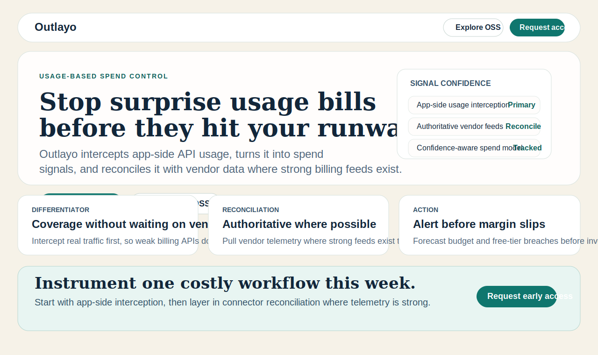
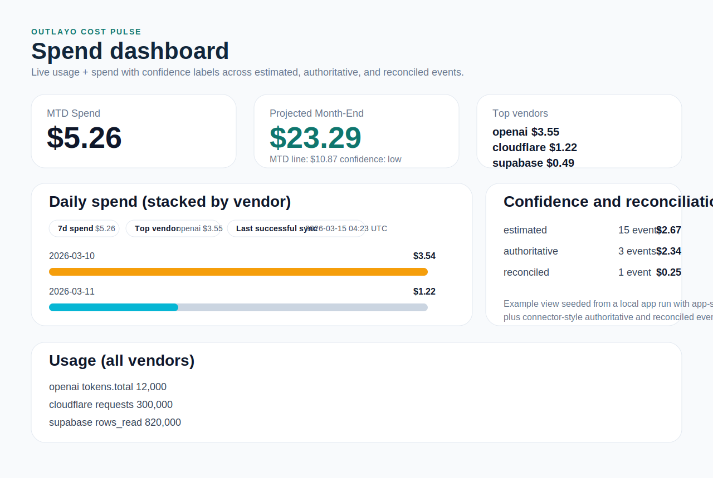

# Outlayo v0.3

Outlayo helps technical teams catch usage-based spend before it becomes an invoice surprise.

This repository is the public OSS monorepo. The root package remains `private` because the repo is not published as a single npm package, not because the code is closed source.

## Why teams use Outlayo

- startup founders who need one place to see usage risk before month-end
- indie hackers who want cost visibility without building internal FinOps tooling
- OSS-minded infra owners who want a self-hostable, inspectable stack

## How Outlayo works

1. Intercept app-side API usage with `@outlayo/sdk-ingest` and preset extractors.
2. Send normalized events to `/api/ingest/events` for immediate visibility.
3. Keep direct vendor connectors enabled where available for authoritative reconciliation.
4. Use confidence labels (`authoritative`, `estimated`, `reconciled`) to understand what is exact vs inferred.

For most users, the SDK path is now one setup call plus preset selection. Raw manual API posting remains available, but it is not the expected primary integration path.

This is important because most vendors do not expose complete billing or usage telemetry through reliable public APIs. Outlayo is intentionally ingest-first for coverage, and connector-assisted for reconciliation where the vendor signal is strong.

Privacy posture: Outlayo does not need your raw traffic to be useful. Default presets extract usage metadata locally and forward minimized normalized events, not raw request/response payloads.

## What ships in v0.3

- Dedicated public website app (`apps/website`) for `outlayo.com`
- Self-hostable service (`apps/server`) for dashboard, API, and ingest runtime
- In-process scheduler polling OpenAI and optional GCP Billing Export every 10 minutes (`[now-2h, now]` window)
- Normalized cost event store with SQLite default and optional Postgres adapter
- MTD + month-end heuristic forecast (MTD average and 7-day average)
- Connector health status and error surfacing
- Multi-vendor summary and stacked daily spend views
- Usage visibility by vendor/metric (for example, OpenAI tokens and GCP sku_cost quantities)
- Optional Anthropic usage ingestion
- Optional AWS Cost Explorer ingestion
- Optional Azure Consumption ingestion
- Optional Milestone-2 infrastructure connectors (Supabase, Vercel, Render, Railway, Cloudflare)
- App-side ingest endpoint and SDK for primary usage collection when vendor APIs are incomplete or insufficient
- Optional webhook alerting when projected month-end exceeds budget
- GCP free-tier proximity tracking for Places API and Geocoding API (config-driven limits)

## Start here

- Product overview and messaging: `docs/positioning-messaging.md`
- Integration lane strategy: `docs/integration-lane-strategy.md`
- Alpha integration set: `docs/alpha-integrations.md`
- 10-minute quickstart: `docs/10-minute-quickstart.md`
- Self-host quickstart: `docs/self-host-golden-path.md`
- App-side interception guide: `docs/app-side-auto-intercept.md`
- Reconciliation walkthrough: `docs/reconciliation-walkthrough.md`
- Proof assets and regeneration notes: `docs/proof-assets.md`
- Connector setup docs: `docs/openai-connection.md`, `docs/gcp-connection.md`, `docs/milestone2-connectors.md`
- Alpha-specific setup docs: `docs/mapbox-connection.md`, `docs/gcp-traffic-presets.md`, `docs/resend-preset.md`
- Contributing: `CONTRIBUTING.md`

## Product proof

Representative proof assets generated from the live local app flow:





- `docs/proof-assets.md` explains what the images represent and how to regenerate them.

## Local setup

1. Copy `.env.example` to `.env` and set connector credentials
2. Install dependencies:

```bash
npm install
```

3. Run tests:

```bash
npm test
```

4. Start the OSS app server:

```bash
npm run dev
```

Then open `http://127.0.0.1:8787`.

5. Start the public website locally:

```bash
npm run website:dev
```

Then open `http://127.0.0.1:4321`.

## CLI onboarding

Use the built-in CLI for guided setup:

```bash
npm run cli -- init --env .env
npm run cli -- doctor --env .env
```

Reference docs:

- `docs/cli-onboarding.md`
- `docs/install-cli.md`

## Live connector verification

Run real poll checks for currently enabled connectors:

```bash
npm run verify:live
```

To verify only selected connectors:

```bash
VERIFY_ONLY=openai,gcp-billing,supabase,cloudflare npm run verify:live
```

Public website: `http://127.0.0.1:4321`

Public website deployment: GitHub Pages from `apps/website` to `https://outlayo.com`

Note: `apps/website/dist/index.html` references a generated stylesheet under `/_astro/`. That is expected for Astro production builds. Preview the built site over HTTP (`npm run website:preview`) rather than opening the HTML file directly from disk.

Hosted app entry (production): `https://app.outlayo.com`

## OSS + hosted topology

Outlayo uses a split model:

- Public OSS + docs surface at `outlayo.com`
- Hosted managed app at `app.outlayo.com`

References:

- `docs/oss-hosted-topology.md`
- `docs/public-private-boundary.md`
- `docs/self-host-vs-hosted.md`
- `CONTRIBUTING.md`
- `SECURITY.md`
- `LICENSE`
- `CODE_OF_CONDUCT.md`

## Environment variables

- `HOST` default `127.0.0.1`
- `PORT` default `8787`
- `ADMIN_TOKEN` required when `HOST` is not local
- `DB_BACKEND` one of `sqlite` or `postgres`
- `SQLITE_PATH` default `./outlayo.db`
- `POSTGRES_URL` required if `DB_BACKEND=postgres`
- `POLL_INTERVAL_MINUTES` default `10`
- `OPENAI_ENABLED` default `true`
- `OPENAI_API_KEY` required if OpenAI connector enabled
- `OPENAI_PROJECT` optional
- `ANTHROPIC_ENABLED` default `false`
- `ANTHROPIC_API_KEY` required if Anthropic connector enabled
- `ANTHROPIC_BASE_URL` optional
- `GCP_ENABLED` default `false`
- `GCP_PROJECT_ID` required if GCP connector enabled
- `GCP_BILLING_DATASET` required if GCP connector enabled
- `GCP_BILLING_TABLE` required if GCP connector enabled
- `GCP_SERVICE_ACCOUNT_JSON` or `GCP_SERVICE_ACCOUNT_FILE` required if GCP connector enabled
- `GCP_API_USAGE_ENABLED` default `false`
- `GCP_FREE_TIER_LIMITS_JSON` required if GCP API usage tracking enabled (example: `{"places-api":50000,"geocoding-api":50000}`)
- `SUPABASE_ENABLED` default `false`
- `SUPABASE_PROJECT_REF` required if Supabase connector enabled
- `SUPABASE_ACCESS_TOKEN` required if Supabase connector enabled
- `SUPABASE_BASE_URL` optional
- `VERCEL_ENABLED` default `false`
- `VERCEL_TOKEN` required if Vercel connector enabled
- `VERCEL_TEAM_ID` required if Vercel connector enabled
- `VERCEL_BASE_URL` optional
- `RENDER_ENABLED` default `false`
- `RENDER_API_KEY` required if Render connector enabled
- `RENDER_OWNER_ID` required if Render connector enabled
- `RENDER_BASE_URL` optional
- `RAILWAY_ENABLED` default `false`
- `RAILWAY_API_TOKEN` required if Railway connector enabled
- `RAILWAY_PROJECT_ID` required if Railway connector enabled
- `RAILWAY_BASE_URL` optional
- `CLOUDFLARE_ENABLED` default `false`
- `CLOUDFLARE_API_TOKEN` required if Cloudflare connector enabled
- `CLOUDFLARE_ACCOUNT_ID` required if Cloudflare connector enabled
- `CLOUDFLARE_BASE_URL` optional
- `AWS_COST_EXPLORER_ENABLED` default `false`
- `AWS_ACCESS_KEY_ID` required if AWS Cost Explorer connector enabled
- `AWS_SECRET_ACCESS_KEY` required if AWS Cost Explorer connector enabled
- `AWS_SESSION_TOKEN` optional
- `AWS_REGION` default `us-east-1`
- `AWS_COST_EXPLORER_ENDPOINT` optional
- `AZURE_CONSUMPTION_ENABLED` default `false`
- `AZURE_SUBSCRIPTION_ID` required if Azure connector enabled
- `AZURE_BEARER_TOKEN` required if Azure connector enabled
- `AZURE_CONSUMPTION_BASE_URL` optional
- `MONTHLY_BUDGET_USD` and `ALERT_WEBHOOK_URL` must both be set to enable alerting
- `ALERT_COOLDOWN_HOURS` default `24`

## OpenAI setup

1. Set `OPENAI_ENABLED=true`.
2. Set `OPENAI_API_KEY`.
3. Optionally set `OPENAI_PROJECT` if your account uses project-scoped keys.

For a full walkthrough (key scope, org/project caveats, troubleshooting), see `docs/openai-connection.md`.

## Anthropic setup

1. Set `ANTHROPIC_ENABLED=true`.
2. Set `ANTHROPIC_API_KEY`.

For details, see `docs/anthropic-connection.md`.

## Budget webhook alerting

Set:

```bash
MONTHLY_BUDGET_USD=500
ALERT_WEBHOOK_URL=https://hooks.slack.com/services/...
ALERT_COOLDOWN_HOURS=24
```

Outlayo posts a Slack-compatible JSON message when projected month-end spend exceeds budget, with cooldown suppression.

## GCP Billing Export setup

1. Enable Cloud Billing Export to BigQuery for your billing account.
2. Set `GCP_ENABLED=true`.
3. Set `GCP_PROJECT_ID`, `GCP_BILLING_DATASET`, and `GCP_BILLING_TABLE`.
4. Provide credentials via either:
   - `GCP_SERVICE_ACCOUNT_JSON` (inline JSON), or
   - `GCP_SERVICE_ACCOUNT_FILE` (path inside runtime environment)

The connector reads authoritative billing costs and normalizes them into `cost_events` with `vendor=gcp`.

For a full walkthrough (IAM roles, env examples, troubleshooting), see `docs/gcp-connection.md`.

## AWS Cost Explorer setup

Set:

```bash
AWS_COST_EXPLORER_ENABLED=true
AWS_ACCESS_KEY_ID=...
AWS_SECRET_ACCESS_KEY=...
AWS_REGION=us-east-1
```

For details, see `docs/aws-connection.md`.

## Azure Consumption setup

Set:

```bash
AZURE_CONSUMPTION_ENABLED=true
AZURE_SUBSCRIPTION_ID=...
AZURE_BEARER_TOKEN=...
```

For details, see `docs/azure-connection.md`.

## GCP free-tier tracking

Enable request-based free-tier tracking for Places and Geocoding:

```bash
GCP_API_USAGE_ENABLED=true
GCP_FREE_TIER_LIMITS_JSON={"places-api":50000,"geocoding-api":50000}
```

Outlayo computes used/remaining/projection per API and surfaces free-tier breach projections in API, dashboard, and alert payloads.

## Milestone-2 infrastructure connectors

See `docs/milestone2-connectors.md` for setup details for Supabase, Vercel, Render, Railway, and Cloudflare.

## App-side ingest and reconciliation

Use `@outlayo/sdk-ingest` with `/api/ingest/events` to submit normalized usage/cost events from your application.
For fetch interception + auto event extraction flow, see `docs/app-side-auto-intercept.md`.
Use app-side interception as the primary path for usage collection, then keep connectors enabled where supported for authoritative reconciliation.

Current happy path: fetch-based runtimes (for example Next.js, Remix, SvelteKit, Nuxt server routes, and Node services using `fetch`).

## Self-host + connector authoring

- Self-host golden path: `docs/self-host-golden-path.md`
- Connector authoring kit: `docs/connector-authoring-kit.md`

## Contributing

- Install with `npm install`
- Run validation with `npm test`
- Follow `CONTRIBUTING.md` for OpenSpec workflow, PR expectations, and repo-boundary rules

## Docker

Use `docker-compose.yml` for a single service deployment:

```bash
docker compose up --build
```

## Messaging reference

Canonical positioning and reusable copy blocks live in `docs/positioning-messaging.md`.

## Connector planning and review

- Top 25 rollout plan: `docs/connector-rollout-plan.md`
- Prioritization review artifact: `docs/connector-priority-review.md`
- Full audited integration table: `docs/integration_research_audited.md`
